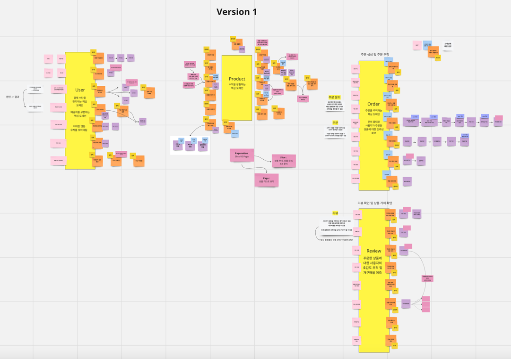
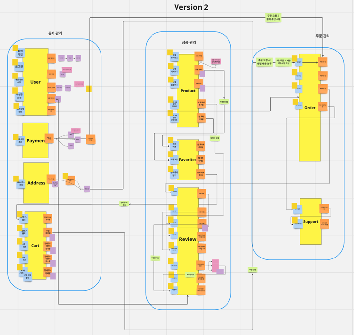

# 💜 마켓컬리 클론코딩 (23.08.26 ~ 23.09.22)

> 마켓컬리 클론 코딩 프로젝트 입니다.  
> 회원가입부터 리뷰 작성까지 일련의 과정을 구현했습니다.  
> 함이커머스의 복잡한 도메인을 경험해볼 수 있다는 점에 있어서 마켓 컬리를 선택하게 되었습니다.

### 💜 프로젝트의 목표

#### 최대한 🔥실패하고 도전하는🔥 프로젝트 ✌️  
1. Trade-Off 고민하기  
2. 우리만의 모듈 구조  
3. 기술 제한 (라이브러리, PasS 등)   
4. 지금까지 배웠던 것들 최대한 활용하기  

> <b>세한</b>  
>최종 프로젝트 전 기술에 대한 숙련도를 향상시키고 여러 가지 시도를 해보고 싶습니다.  
이를 위해 단순히 찍어내기식 API 개발보다는 도메인을 분석하고 충분한 고민이 있는 코드를 만들고 싶습니다.  
프로젝트를 진행하면서 리팩토링을 꾸준히 진행하고 여러가지 디자인 패턴을 적용해보기 위해 노력하였습니다.

> <b>수연</b>  
> 기술의 다양성이 아닌 이때까지 배운 것들에 대한 집합이라는 목적을 가지고 임하였다.  
최대한 실패하고 해결해 나가며 성장에 목적을 둔 프로젝트이다.  
팀원들과 다양한 협업툴을 이용해 협업해보는 경험을 얻어가고 싶었다. (GitHub, Jira등)  
나의 생각을 최대한 전달하고 녹여낼 수 있도록 하자.   

> <b>희조</b>  
> 팀원들의 성장을 위해서 최대한 지원해주기  
아키텍처에 대한 고민을 최대한 해보기  
최대한 다른 자원의 도움 없이 자바로 구현하기

## 💜 소중한 팀원들

|         Product Owner (CTO)          |         Scrum Master (CEO)         |         Developer (서포터)         |
|:------------------------------------:|:----------------------------------:|:-------------------------------:|
| [장수연](https://github.com/sujjangOvO) | [오세한](https://github.com/2jie0516) | [문희조](https://github.com/Hejow) |

## 💜 도메인 분석 ([MIRO](https://miro.com/app/board/uXjVMrSCrG0=/?share_link_id=156100042697))

## 💜 기술 스택

### 개발 환경

</a>
</a>
</a>
</a>
 
</a>
</a>
</a>
</a>
</a>
 

### ERD

[ERD 바로가기](https://www.erdcloud.com/d/f9HnabjuRZAvYufzS)

### 모듈 구조
(삽입 예정)

## 💜 컨벤션
- 트렁크 기반 Git  
- PR 병합 규칙 : **[지라 이슈키] prefix: ${주요 작업} (#PR번호)**

| 기본 Rule               | 오문장 Rule                   |
|-----------------------|----------------------------|
| Feat:                 | 추가:                        |
| X                     | 수정: (이름 변경, Return 값 변경 등) |
| Fix:                  | 버그:                        |
| Refactor:             | 리팩토링:                      |
| Design:               | 프론트:                       |
| Test:                 | 테스트:                       |
| Docs:                 | 문서:                        |
| Chore: (위에 걸리지 않는 경우) | 기타: (사용한다면 body 작성하기)      |

### 💜 팀 페이지
🔮️ [팀 노션](https://www.notion.so/backend-devcourse/Team-Project-bb03676699354455902ecc34ff24440d)  
🔮️ [지라](https://2jie0516.atlassian.net/jira/software/projects/KM/boards/1?assignee=62c79dadb6357aecd7c7d360)  

